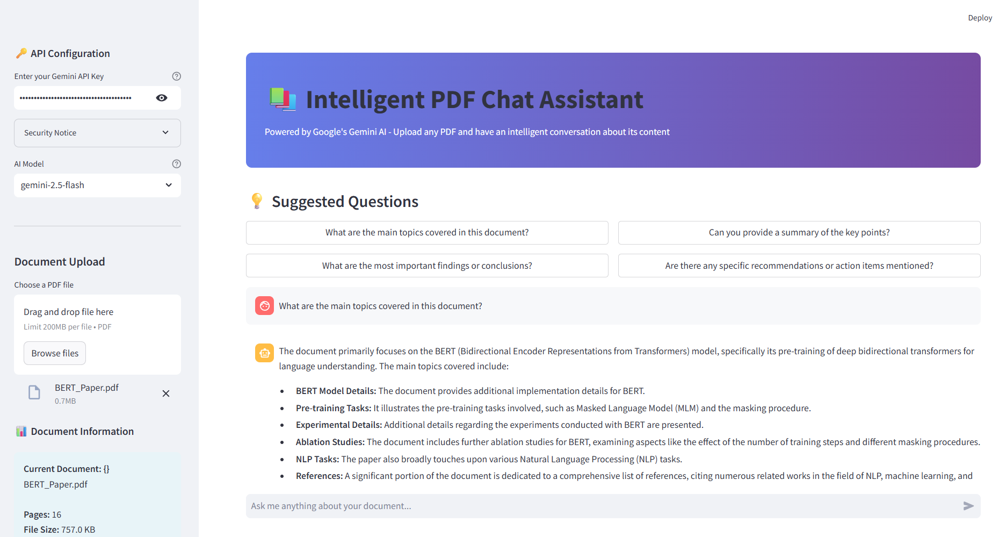

# PDF Chat with Gemini AI

A web-based application for intelligent PDF document analysis using Google's Gemini AI with File Search capabilities. Upload PDF documents and have natural conversations about their content.

## Features

- **Intelligent Document Search**: Leverages Gemini's File Search API for accurate, context-aware responses
- **Multiple AI Models**: Choose between Gemini 2.5 Flash (faster) or Pro (more capable)
- **Session Management**: Track questions, view document metadata, and monitor conversation history
- **Export Conversations**: Download chat history as JSON for record-keeping
- **Smart Suggestions**: Get started with AI-generated question suggestions
- **Source Attribution**: View references and sources for AI responses

## Demo



## Quick Start

### Prerequisites

- Python 3.8 or higher
- Google Gemini API Key ([Get one here](https://makersuite.google.com/app/apikey))

### Installation

```bash
# Clone the repository
git clone https://github.com/frankwiersma/pdf-chat-gemini.git
cd pdf-chat-gemini

# Install dependencies
pip install -r requirements.txt

# Run the application
streamlit run src/app.py
```

The application will open in your browser at `http://localhost:8501`

### Docker (Optional)

```bash
docker build -t pdf-chat-gemini .
docker run -p 8501:8501 pdf-chat-gemini
```

## Usage

1. **Enter API Key**: Input your Gemini API key in the sidebar
2. **Select Model**: Choose between Flash (faster) or Pro (more thorough)
3. **Upload PDF**: Select a PDF document to analyze
4. **Ask Questions**: Type questions or use suggested prompts
5. **Export**: Save your conversation history if needed

## Configuration

The application can be configured via `.streamlit/config.toml`:

```toml
[browser]
gatherUsageStats = false

[server]
headless = false

[theme]
base = "light"
```

## Security

This application implements a secure API key model:

- API keys are stored only in browser session memory
- No server-side storage of credentials
- Each user manages their own API usage and costs
- Keys are cleared on browser refresh

**Best Practices**:
- Run locally for maximum security
- Never commit API keys to version control
- Review API usage regularly in Google AI Studio
- Use environment variables for production deployments

## Technical Details

### Architecture

The application uses:
- **Streamlit**: Web application framework
- **google-genai**: Official Gemini AI SDK
- **PyPDF2**: PDF text extraction and metadata
- **File Search Store**: Gemini's vector-based document search

### File Structure

```
pdf-chat-gemini/
├── src/
│   └── app.py              # Main application
├── demo_pdfs/              # Sample PDFs for testing
├── .streamlit/
│   └── config.toml         # Streamlit configuration
├── requirements.txt        # Python dependencies
└── README.md
```

### Supported File Types

- PDF documents (up to 5MB recommended)
- Text-based PDFs (scanned documents may have limited support)

## Performance

- **Recommended file size**: Under 2-3 MB for optimal performance
- **Maximum file size**: 5 MB (API limitation)
- **Upload timeout**: 10 minutes for large files
- **Processing time**: Varies by document size and model

## Limitations

- PDF size limitations imposed by Gemini API
- Scanned PDFs require OCR preprocessing
- Rate limits apply based on API tier
- Internet connection required

## Troubleshooting

**Upload Errors**
- Ensure PDF is under 5MB
- Verify API key is valid and has quota
- Check file is not corrupted

**No Response Generated**
- Rephrase your question
- Verify PDF contains searchable text
- Check API key has remaining quota

**Connection Issues**
- Verify internet connectivity
- Check Gemini API status
- Review firewall settings

## Development

### Running in Development Mode

```bash
streamlit run src/app.py --logger.level=debug
```

### Custom Port

```bash
streamlit run src/app.py --server.port=8502
```

### Environment Variables

```bash
# Optional: Set default API key (not recommended for production)
export GEMINI_API_KEY=your_api_key_here
```

## Contributing

Contributions are welcome! Please:

1. Fork the repository
2. Create a feature branch (`git checkout -b feature/improvement`)
3. Commit your changes (`git commit -am 'Add new feature'`)
4. Push to the branch (`git push origin feature/improvement`)
5. Open a Pull Request

## License

This project is licensed under the MIT License - see the [LICENSE](LICENSE) file for details.

## Acknowledgments

- Built with [Streamlit](https://streamlit.io/)
- Powered by [Google Gemini AI](https://deepmind.google/technologies/gemini/)
- PDF processing by [PyPDF2](https://pypdf2.readthedocs.io/)

## Support

For issues and questions:
- Open an issue on GitHub
- Review the [Gemini API documentation](https://ai.google.dev/docs)
- Check existing issues for solutions

---

**Note**: This application requires a valid Gemini API key. Usage costs are determined by your API tier and consumption.
